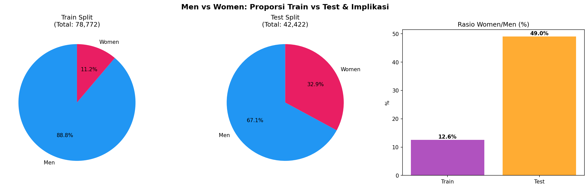
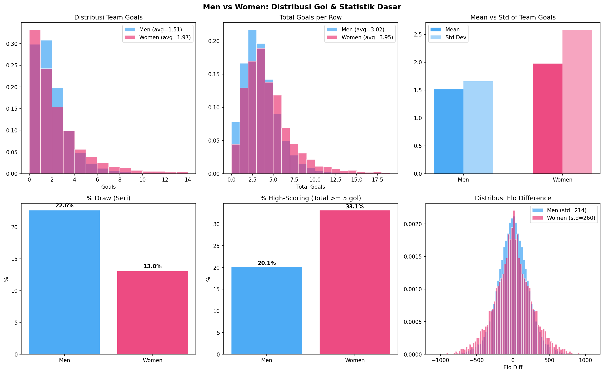
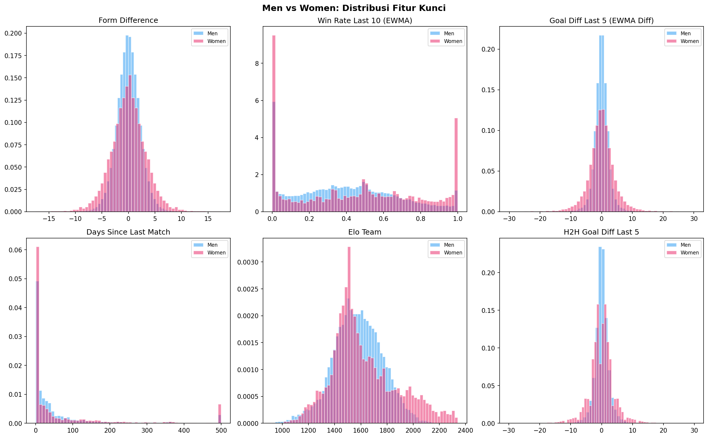
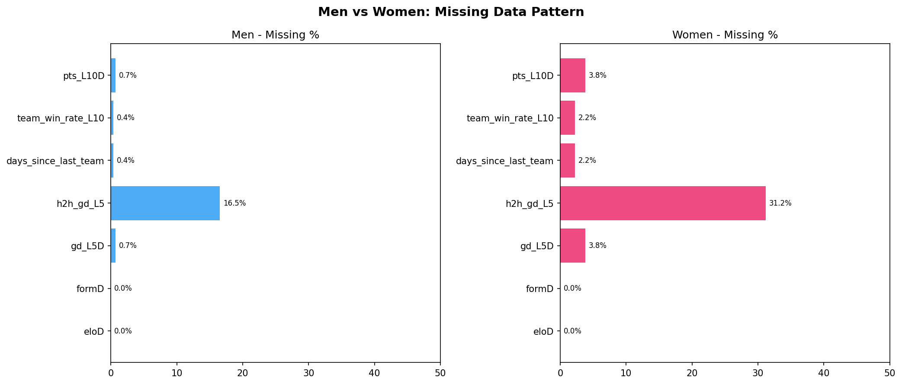
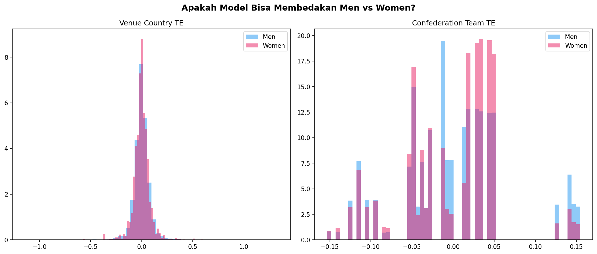

# Analisis Mendalam: Men vs Women Football

> Analisis perbandingan karakteristik pertandingan sepak bola pria dan wanita dalam dataset training dan test.

---

## 1. Gambaran Umum Data

| Metrik | Men (Train) | Women (Train) | Men (Test) | Women (Test) |
|---|---|---|---|---|
| Jumlah Baris | 69,966 | 8,806 | 28,464 | 13,958 |
| Proporsi | 88.8% | 11.2% | 67.1% | 32.9% |
| Rasio W/M | - | 12.6% | - | 49.0% |

> [!WARNING]
> **Distribusi bergeser!** Di training, women hanya **11.2%** dari data. Di test, women naik ke **32.9%**. Ini berarti model yang under-represent women di training akan **lebih terekspos** di test.

## 2. Karakteristik Gol

| Metrik | Men | Women | Delta |
|---|---|---|---|
| Rata-rata Team Goals | 1.51 | 1.97 | +0.46 |
| Rata-rata Total Goals (per row) | 3.02 | 3.95 | +0.93 |
| Std Dev Team Goals | 1.66 | 2.58 | +0.93 |
| % Draw | 22.6% | 13.0% | -9.6% |
| % High-Scoring (>=5 total) | 20.1% | 33.1% | +13.0% |

## 3. Perbedaan Distribusi Fitur

| Fitur | Men Mean | Women Mean | Men Std | Women Std | Insight |
|---|---|---|---|---|---|
| `elo_diff` | 0.00 | 0.00 | 213.74 | 260.06 | Women memiliki spread Elo yang lebih lebar - lebih banyak match timpang |
| `form_diff` | 0.00 | 0.00 | 2.23 | 3.33 | Form diff mirip antar gender |
| `gd_last5_ewma_diff` | 0.00 | 0.00 | 2.40 | 4.48 | Women cenderung GD lebih ekstrem |
| `team_win_rate_last10_ewma` | 0.40 | 0.46 | 0.27 | 0.33 | Win rate distribution serupa |
| `elo_team` | 1576.01 | 1619.89 | 186.37 | 250.06 | Rentang Elo women lebih sempit |

## 4. Pola Missing Data

Women's football memiliki sejarah data yang **lebih pendek** dibanding men's. Ini menyebabkan:

- **H2H features**: Men missing 16.5%, Women missing 31.2%
- **Days since last match**: Men missing 0.4%, Women missing 2.2%
- **Form features**: Men missing 0.0%, Women missing 0.0%

## 5. Apakah Model Kita Sudah Menangkap Perbedaan Gender?

### Analisis Arsitektur Model Saat Ini

**Fakta kritis**: Dataset `train_final.csv` **TIDAK memiliki kolom `gender`**. 
Model kita (LightGBM + XGBoost) tidak memiliki akses langsung ke informasi apakah sebuah match adalah men atau women.

#### Apakah fitur lain secara tidak langsung encode gender?

- **Elo Team**: Men range [1266, 1881], Women range [1267, 2105]
  - Range **overlap hampir sempurna** karena Elo dihitung independen per gender. Model TIDAK bisa bedakan gender dari Elo saja.
- **Venue Country TE**: Men mean=-0.0000, Women mean=0.0002
- **Confederation TE**: Men mean=0.0001, Women mean=-0.0005

## 6. Temuan Kunci & Rekomendasi

### Masalah Utama

> [!CAUTION]
> **Model kita saat ini BUTA GENDER.** Tidak ada satu pun fitur yang secara eksplisit memberi tahu model apakah match ini men atau women. Padahal perbedaan karakteristik antara keduanya signifikan.

### Perbedaan Kritis yang Tidak Tertangkap

1. **Volatilitas gol women lebih tinggi** — Std dev gol women lebih besar, artinya prediksi Poisson lambda yang sama akan memiliki error berbeda untuk men vs women
2. **Distribusi proporsi bergeser di test** — Women naik dari ~11% ke ~33% di test. Model yang overfit ke pola men akan kehilangan akurasi.
3. **Missing data lebih banyak di women** — Fitur H2H dan form sering kosong untuk women karena sejarah data lebih pendek. Model mungkin mengisi ini dengan cara yang suboptimal.
4. **Persentase draw berbeda** — Ini langsung mempengaruhi ERM karena outcome prediction weight di AW-MAE.

### Rekomendasi Perbaikan

| Prioritas | Aksi | Dampak Estimasi |
|---|---|---|
| **P0 (Kritis)** | Tambah fitur binary `is_women` ke train_final dan test_final | Model bisa mempelajari pattern berbeda per gender |
| **P1 (Tinggi)** | Tuning tournament weight terpisah untuk turnamen women | Bobot AW-MAE lebih akurat |
| **P2 (Medium)** | Cek apakah Elo system men vs women sudah dipisah di feature engineering | Pastikan Elo tidak cross-contaminate |
| **P3 (Low)** | Eksperimen train model terpisah men/women | Risiko overfitting women karena data sedikit |
